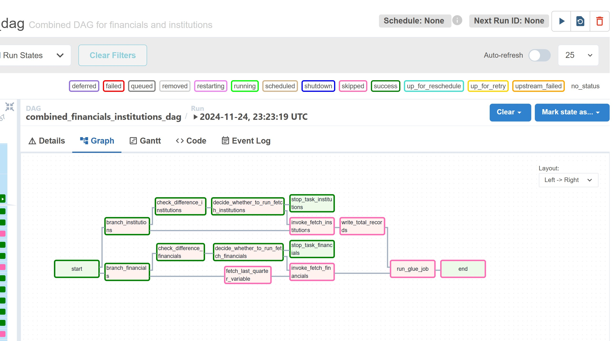

# Bank Data Pipeline for Alpharank

## **Objective**
Develop a data pipeline to ingest and normalize financial data from publicly accessible regulatory sources for banks. The pipeline processes data from the **FDIC API** to provide key insights into financial health and performance of banks.

---

## **Data Pipeline Design**

### **Key Components**
1. **Source**: FDIC API for banks ([Documentation](https://banks.data.fdic.gov/docs/)).
2. **Destination**: Processed data stored in **AWS S3**.
3. **Processing**: Use AWS Glue for ETL, normalizing the data for analytics.
4. **Insights**:
   - Number of active banks by asset tier.
   - Banks with >5% decline in deposits last quarter.

---

## **Pipeline Overview**
- **DAG Orchestration**: Apache Airflow
- **Storage**: AWS S3
- **ETL**: AWS Glue
- **Automation**: Lambda functions for conditional execution and monitoring.

### **Airflow DAG Example**
Below is the visual representation of the Airflow DAG pipeline used for orchestrating the tasks in this pipeline:



---

## **Pipeline Flow**

1. **Start Task**
   - A dummy task to initialize the pipeline.

2. **Branching Logic**
   - **Check if S3 bucket for financial data is empty**:
     - If empty, proceed to fetch data from FDIC.
     - Otherwise, check for differences in the existing data.

3. **Fetch Quarterly Data**
   - Determine the last and previous quarters dynamically.
   - Invoke a Lambda function to fetch financial data for the respective quarters.

4. **Check for Changes**
   - Use a Lambda function to check if updates are needed in the financial data.
   - Proceed based on the outcome:
     - Fetch data if updates are needed.
     - Skip fetching if no updates are required.

5. **AWS Glue Job**
   - After data fetching, trigger an AWS Glue job to transform and normalize the financial data.
   - Extract the following key statistics:
     - **Type**: Bank or Credit Union (Currently focused on Banks).
     - **Charter Number**, **Web Domain**, **City**, **State**.
     - **Total Assets** and **Total Deposits** at the end of each quarter.

6. **Insights Generation**
   - Store the processed data in AWS S3 for analytics.
   - Provide database queries to answer the following:
     - Number of active banks by asset tier (e.g., assets between $500M and $1B).
     - Identify banks with >5% decline in deposits last quarter.

7. **End Task**
   - Conclude the DAG execution.

---

## **Pipeline Details**

### **Components**
- **Airflow DAG**:
  - Controls the end-to-end orchestration of data ingestion, processing, and monitoring.
  - Includes branching logic to handle conditional flows.
  -  *(For reference, see the visual pipeline above)*.

- **AWS Glue**:
  - Performs transformations to normalize and aggregate financial data.
  - Prepares data for analytics and visualization.

- **Lambda Functions**:
  - Check for data availability or differences.
  - Trigger data fetching and transformations dynamically.

- **AWS S3**:
  - Stores raw and processed data securely for analytics.

---

## **Challenges & Solutions**
1. **Credit Union Data Unavailability**:
   - Skipped processing for credit union data as the API is currently down.
   - Modular pipeline design allows easy integration of credit union data once available.

2. **Data Normalization**:
   - Standardized fields such as charter number, web domain, assets, and deposits to enable unified analytics.

3. **On-Demand Execution**:
   - Designed to rerun and update data whenever new quarterly data is released.

---

## **Next Steps**
- Integrate credit union data once the API is available.
- Add more insights, such as trends over time and regional comparisons.
- Enhance automation and error handling to ensure seamless execution.

---

## **Key Queries**
### Example Queries for Analytics:
1. **Active Banks by Asset Tier**:
   ```sql
   SELECT COUNT(*) AS active_banks, 
          CASE 
              WHEN total_assets BETWEEN 500000000 AND 1000000000 THEN '500M-1B'
              WHEN total_assets > 1000000000 THEN '>1B'
              ELSE '<500M'
          END AS asset_tier
   FROM financials
   WHERE type = 'Bank'
   GROUP BY asset_tier;
