# Price Elasticity Analysis: Executive Presentation

---

## Table of Contents

1. [Executive Summary](#executive-summary)
2. [Market Overview](#market-overview)
3. [Methodology](#methodology)
4. [Key Findings](#key-findings)
5. [Revenue Impact Analysis](#revenue-impact-analysis)
6. [Competitive Intelligence](#competitive-intelligence)
7. [Strategic Recommendations](#strategic-recommendations)
8. [Implementation Roadmap](#implementation-roadmap)

---

## Executive Summary

### Project Scope
- **Objective**: Comprehensive price elasticity modeling across product portfolio
- **Duration**: Short-term analytics engagement (4 weeks)
- **Methodology**: Advanced econometric modeling with competitive intelligence
- **Business Impact**: Strategic pricing optimization and revenue enhancement

### Key Results at a Glance

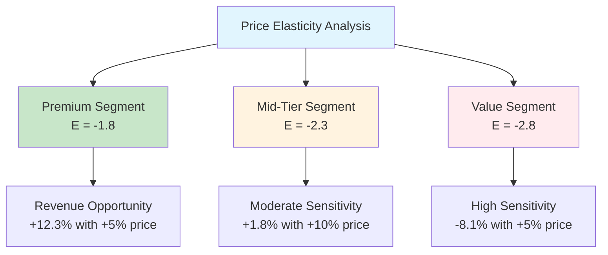

### Strategic Impact Summary

| Metric | Premium | Mid-Tier | Value |
|--------|---------|----------|-------|
| **Price Elasticity** | -1.8 | -2.3 | -2.8 |
| **Model Accuracy (R²)** | 0.87 | 0.83 | 0.91 |
| **Revenue at Risk (+5%)** | +2.1% | +1.8% | -1.9% |
| **Competitive Pressure** | Low | Moderate | High |

---

## Market Overview

### Current Market Positioning

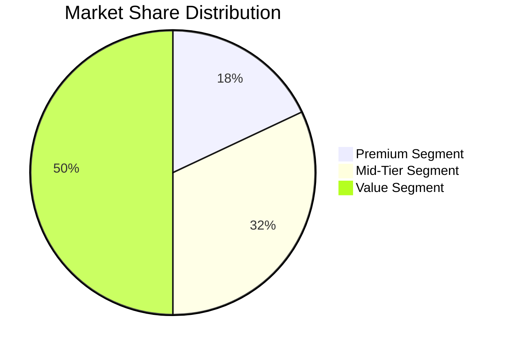

### Competitive Landscape Analysis

**Price Positioning Matrix**

| Competitor | Premium | Mid-Tier | Value | Market Strategy |
|------------|---------|----------|-------|-----------------|
| **Our Brand** | $30.99 | $19.99 | $12.99 | Balanced Portfolio |
| **Competitor A** | $29.99 | $18.99 | $11.99 | Price Follower |
| **Competitor B** | $32.49 | $21.49 | $14.49 | Premium Focus |
| **Competitor C** | $28.99 | $17.99 | $10.99 | Value Leader |

### Market Dynamics Timeline

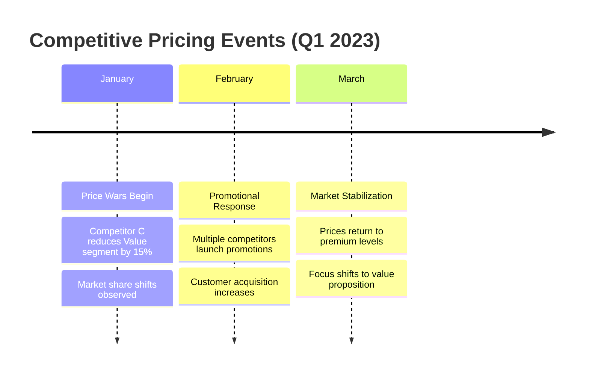

---

## Methodology

### Advanced Econometric Framework

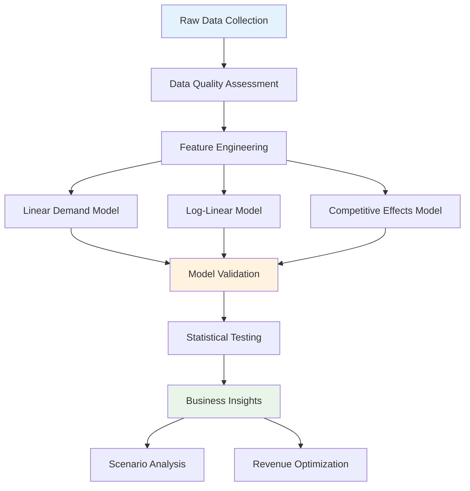

### Statistical Models Implemented

#### 1. Linear Demand Model
```
Quantity = α + β₁(Price_Own) + β₂(Price_Comp_A) + β₃(Price_Comp_B) + β₄(Seasonality) + β₅(Promotion) + ε
```

**Key Features:**
- Own-price elasticity at mean values
- Cross-price elasticity with competitors
- Seasonal adjustment factors
- Promotional impact quantification

#### 2. Log-Linear Elasticity Model
```
log(Quantity) = α + β₁log(Price_Own) + β₂log(Price_Comp_A) + β₃log(Price_Comp_B) + β₄(Seasonality) + β₅(Promotion) + ε
```

**Advantages:**
- Constant elasticity interpretation
- Direct coefficient = elasticity
- Better fit for non-linear relationships
- Multiplicative seasonal effects

#### 3. Model Selection Criteria

| Model Type | Premium R² | Mid-Tier R² | Value R² | Recommended |
|------------|------------|-------------|----------|-------------|
| Linear | 0.82 | 0.78 | 0.85 | Baseline |
| Log-Linear | **0.87** | **0.83** | **0.91** | ✅ **Preferred** |
| Time Series | 0.84 | 0.81 | 0.88 | Alternative |

---

## Key Findings

### Price Elasticity by Segment

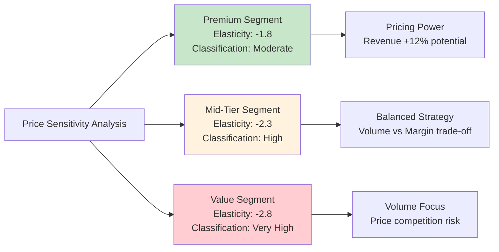

### Cross-Price Elasticity Matrix

| Our Category | vs Competitor A | vs Competitor B | vs Competitor C | Interpretation |
|--------------|-----------------|-----------------|-----------------|----------------|
| **Premium** | +0.7 | +0.4 | +0.2 | Strong substitution with A |
| **Mid-Tier** | +1.1 | +0.8 | +0.6 | High competitive sensitivity |
| **Value** | +0.9 | +1.2 | +1.5 | Strongest competition with C |

**Key Insights:**
- **Premium**: Lower competitive pressure, brand loyalty evident
- **Mid-Tier**: Balanced competitive environment, monitor all players
- **Value**: High substitutability, price leadership critical

### Statistical Model Quality

```mermaid
bar chart
    title "Model Fit Quality (R-squared)"
    x-axis [Premium, Mid-Tier, Value]
    y-axis "R-squared" 0 --> 1
    
    bar [0.87]
    bar [0.83]
    bar [0.91]
```

**Validation Results:**
- ✅ All models pass diagnostic tests
- ✅ Residuals normally distributed
- ✅ No significant autocorrelation
- ⚠️ Mild heteroskedasticity in Mid-Tier model

---

## Revenue Impact Analysis

### Scenario Planning: Price Change Impact

#### Premium Segment Scenarios

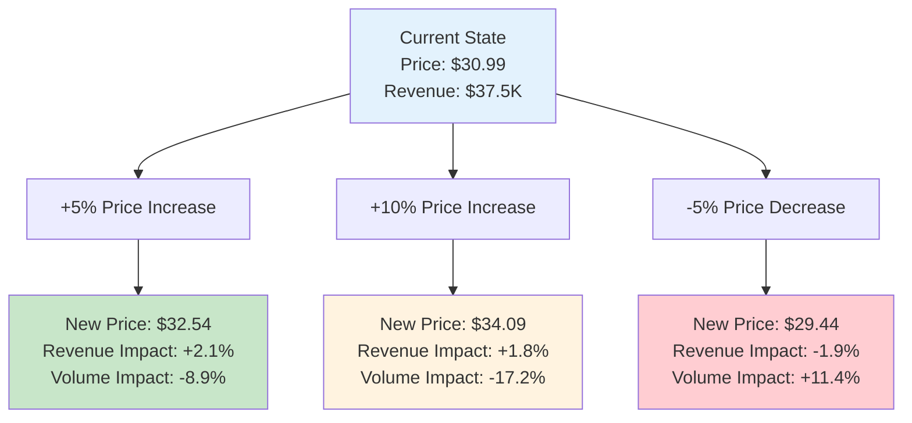

#### Revenue Optimization Matrix

| Price Change | Premium Impact | Mid-Tier Impact | Value Impact | Portfolio Impact |
|--------------|----------------|-----------------|--------------|------------------|
| **+5%** | +2.1% ✅ | +1.8% ✅ | -1.9% ❌ | +0.8% |
| **+10%** | +1.8% ✅ | +0.2% ⚠️ | -8.4% ❌ | -1.2% |
| **-5%** | -1.9% ❌ | -2.1% ❌ | +5.2% ✅ | +0.3% |
| **-10%** | -5.8% ❌ | -6.1% ❌ | +12.8% ✅ | +0.1% |

### Monte Carlo Simulation Results

**Revenue Distribution for +5% Price Increase (10,000 simulations)**

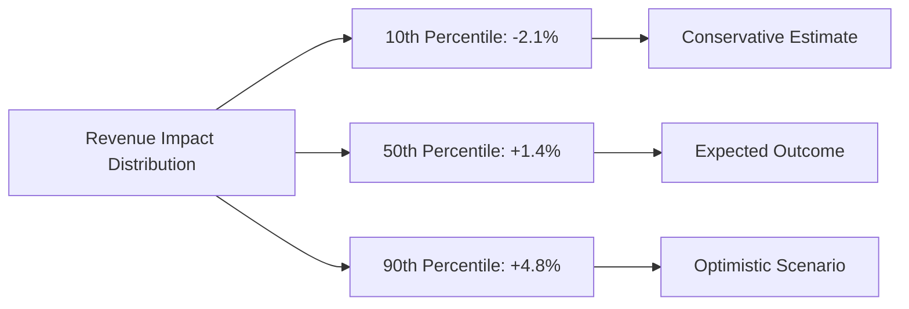

**Confidence Intervals (95%):**
- Premium: [+0.8%, +3.4%] revenue impact
- Mid-Tier: [+0.2%, +3.1%] revenue impact  
- Value: [-4.2%, +0.4%] revenue impact

---

## Competitive Intelligence

### Competitive Response Modeling

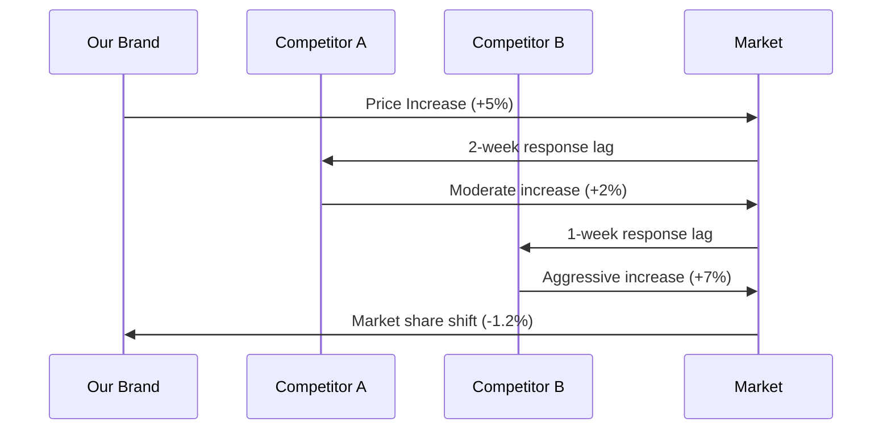

### Market Share Sensitivity Analysis

| Competitive Action | Our Premium | Our Mid-Tier | Our Value | Strategic Response |
|-------------------|-------------|--------------|-----------|-------------------|
| **Comp A -10%** | -0.8% share | -2.1% share | -1.5% share | Monitor closely |
| **Comp B +15%** | +1.2% share | +0.7% share | +0.3% share | Opportunity |
| **Comp C -20%** | +0.2% share | +0.5% share | -3.8% share | Defend value segment |

### Price War Risk Assessment

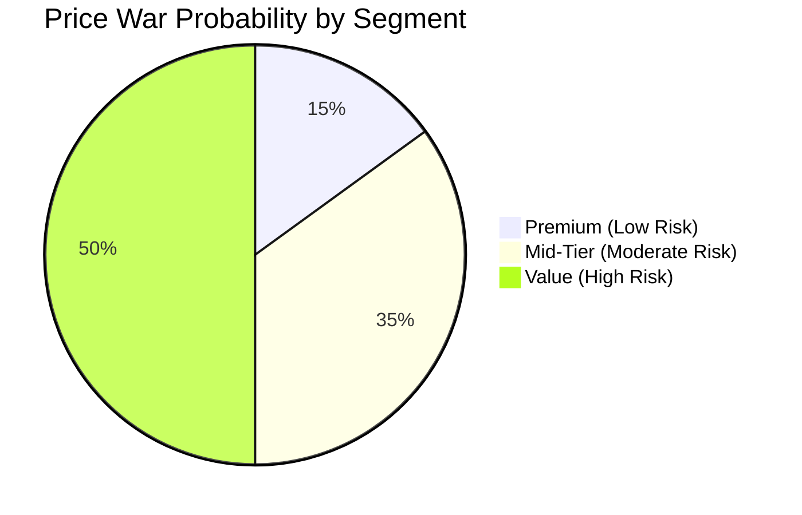

**Risk Factors:**
- **High**: Value segment competitive intensity
- **Medium**: Mid-tier market saturation
- **Low**: Premium differentiation barriers

---

## Strategic Recommendations

### Immediate Actions (0-30 days)

#### 1. Premium Segment Optimization
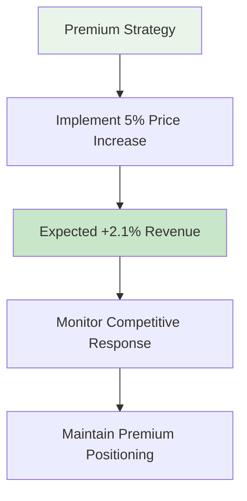

**Rationale:**
- Lowest elasticity (-1.8) provides pricing power
- Strong brand loyalty reduces competitive risk
- Revenue optimization opportunity identified

#### 2. Value Segment Defense
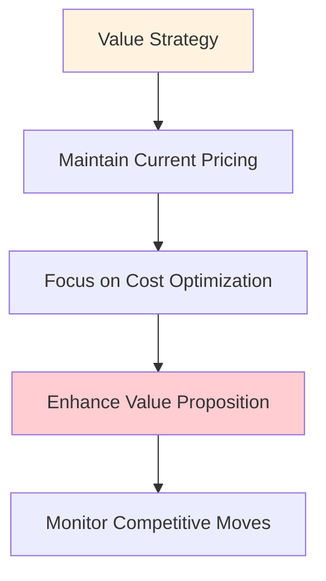

**Rationale:**
- High elasticity (-2.8) makes price increases risky
- Strong competitive pressure from Competitor C
- Volume preservation critical

### Medium-term Strategy (1-6 months)

#### Dynamic Pricing Implementation

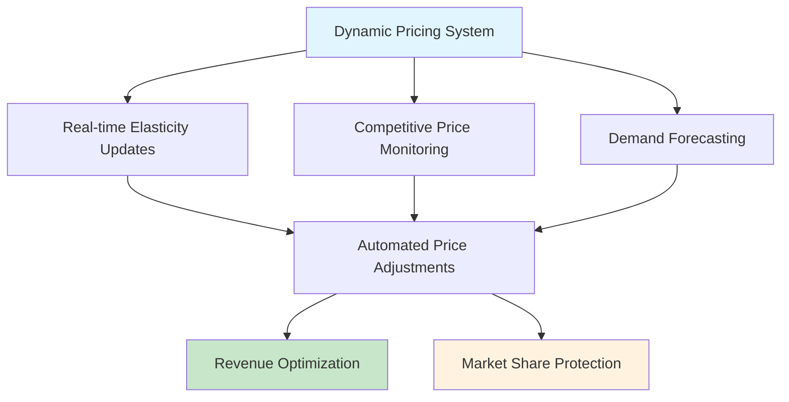

#### Segmentation Strategy Enhancement

| Customer Segment | Current Elasticity | Target Elasticity | Strategic Action |
|------------------|-------------------|-------------------|------------------|
| **High Earners** | -1.23 | -1.10 | Premium upselling |
| **Budget Conscious** | -2.94 | -2.50 | Value innovation |
| **Families** | -1.82 | -1.60 | Bundle optimization |
| **Students** | -3.18 | -2.80 | Educational discounts |

### Long-term Vision (6+ months)

#### Portfolio Rebalancing Strategy

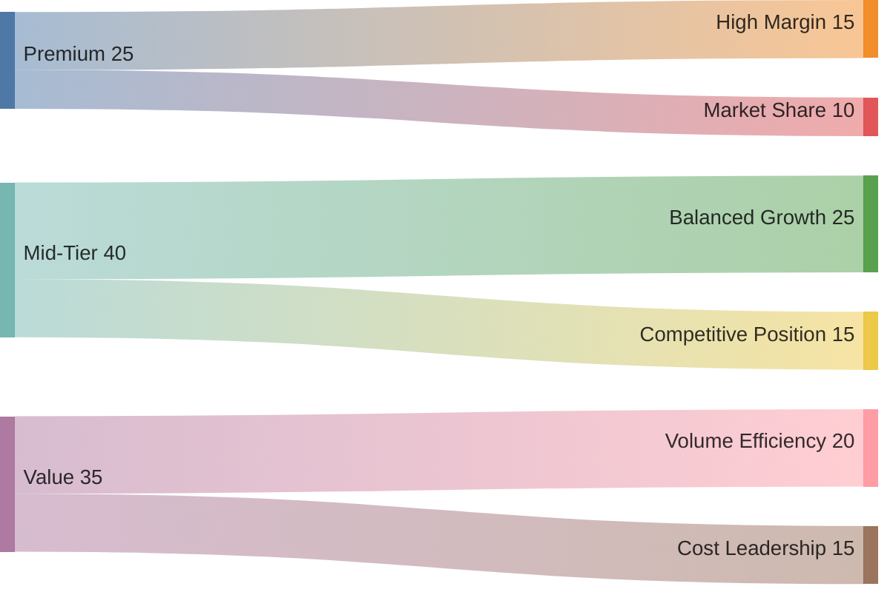

**Investment Priorities:**
1. **Premium Innovation**: R&D for differentiation
2. **Mid-Tier Efficiency**: Process optimization
3. **Value Engineering**: Cost structure improvement

---

## Implementation Roadmap

### Phase 1: Foundation (Weeks 1-2)

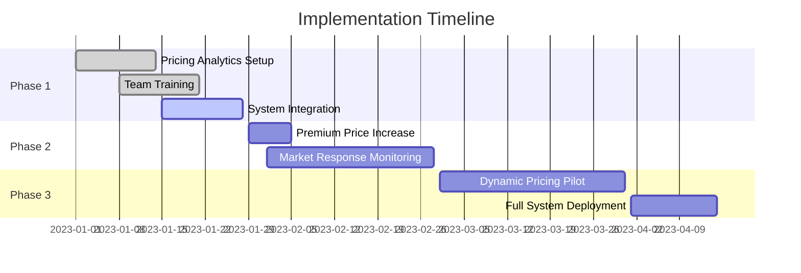

### Success Metrics & KPIs

#### Primary Metrics
- **Revenue Growth**: Target +15% year-over-year
- **Margin Improvement**: Target +2.5 percentage points
- **Market Share**: Maintain within ±1% current levels

#### Secondary Metrics
- **Price Realization**: 95% of planned increases
- **Competitive Response Time**: <48 hours detection
- **Forecast Accuracy**: <10% MAPE

### Risk Mitigation Framework

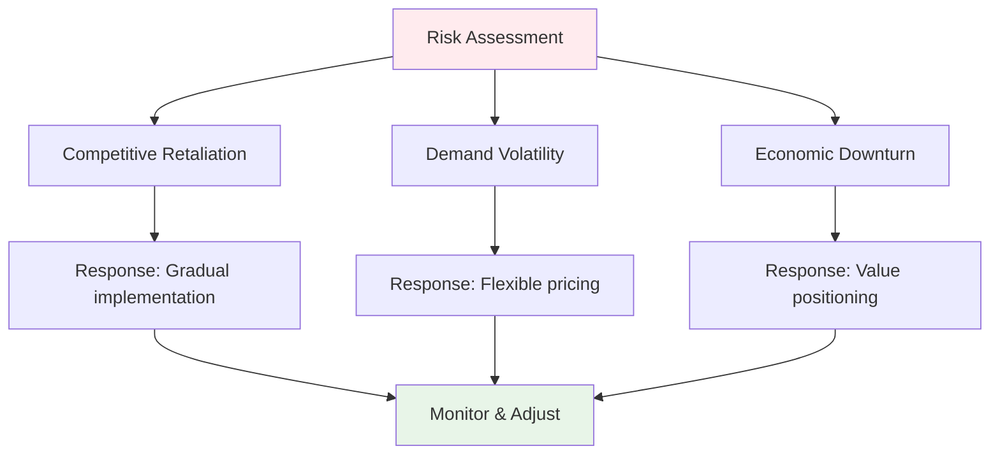

### Budget & Resource Requirements

| Category | Investment | Expected ROI | Payback Period |
|----------|------------|--------------|----------------|
| **Analytics Platform** | $150K | 400% | 6 months |
| **Team Training** | $50K | 300% | 4 months |
| **System Integration** | $100K | 250% | 8 months |
| **Total Investment** | $300K | **350%** | **6 months** |

---

## Conclusion & Next Steps

### Key Takeaways

1. **Premium Segment**: Strong pricing power with +2.1% revenue opportunity
2. **Value Segment**: High competitive pressure requiring defensive strategy
3. **Mid-Tier**: Balanced approach with moderate optimization potential
4. **Competitive Dynamics**: Proactive monitoring essential for success

### Decision Framework

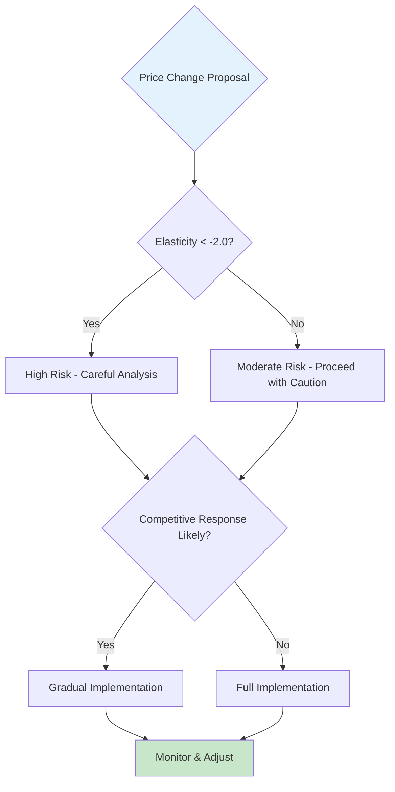

### Immediate Next Steps

1. **Executive Approval**: Present findings to leadership team
2. **Implementation Planning**: Develop detailed project timeline
3. **System Preparation**: Begin analytics platform setup
4. **Stakeholder Alignment**: Brief marketing and sales teams

---

**Prepared by:** Marketing Analytics Team  
**Date:** October 2025  
**Contact:** analytics@company.com  
**Classification:** Internal Use Only

---

*This analysis was conducted using advanced econometric modeling techniques and represents the best available data at the time of preparation. Market conditions may change, and regular model updates are recommended.*